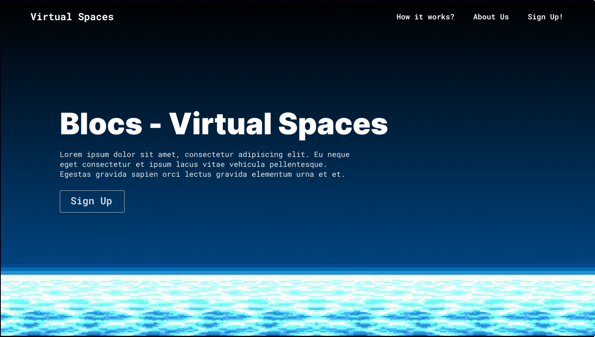
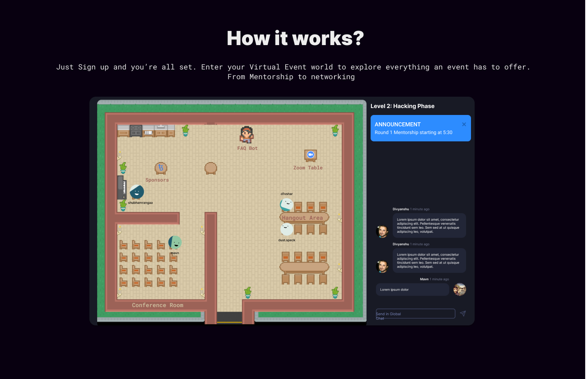

# 💻 Project Name

## Blocs - Virtual Spaces

# 🚀 Tagline

### Get rid of boring discord servers! Experience virtual events in a whole new way!

# 💡 The Problem it solves

### Boring Discord Servers

- Ever since 2020, Events are going online! This calls for a revamp of our event infrastructure as more and more events are held online or hybrid.
- Discord servers are not a good interface for hosting events, they can get overwhelming, un-navigable boring as the size of the event grows.

  - What we're trying to do is we're making a **virtual, but extremely visual representation of an event**, **A virtual Space for events**
  - You can visualize and "live" the event just like offline events.
  - We created a 2D map which mocks the real environment of an event.
  - Some of the key features include:-
    - **VIRTUAL ROOMS**
      - Rooms for All Webinars
      - Rooms for Minor Events
      - Rooms for Sponsors
      - Rooms for Networking
    - **THEMED MAPS**
      - All events are different, which calls for the need to be able to build UIs that cater to the events needs
      - You can _make your own map_ for your events
    - **INTERACTIVE OBJECTS**
      - These virtual spaces can have interactive objects, when a user visits these objects they respond with premade templates.
      - Examples:
        - **Zoom Bots** - create zoom meeting links, instantaneously
        - **FAQ Bots** - Ask anything about the event!
        - **Advertisment Bots**
    - **EVENT LEVELS**
      - Phases of the events can be categorised as game levels
      - Ex: Level 2 == Hacking phase
      - This gives a direct visula cue of whats going on in the event!

# 🧠 Challenges we ran into

- Making a virtual world sounds exciting, but, its complicated!
  - Under the hood this a **2D Realtime Multiplayer RPG Game!**
  - We faced a lot of challenges while selecting the right Game engine to get the work done.
  - Lots reading documentation was done.
- Every thing had to happen in REALTIME
  - We had to learn about WebSockets and implement complex server side logic using the same.
- Lastly, choosing a good name was a pain in the B.

# 🔨 Technologies Used :

- Socket IO
- PIXI JS
- Agora
- Node JS
- React
- NextJS
- HTML/CSS/JavaScript
- SCSS
- Figma

# 🔗 Links

- GitHub: https://github.com/21VAibhavGArg/blocs
- Figma: https://www.figma.com/file/1gjv3O2YQ69UD2rle8fuuj/Proto?node-id=130%3A145

# 🎥 Video Demo

- https://www.youtube.com/watch?v=XVVm1w_qiUY

# 📷 Pictures

